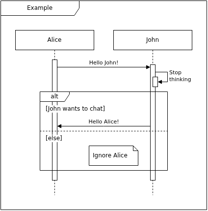

# drawio-seqgen



[Example Source File](doc/example.seq)

A script which turns a text based sequence description into a sequence diagram similar to PlantUML or Mermaid.js,
but the resulting file is an editable draw.io diagram instead of an image file.

## Usage

```
src/main.py -i [input_file] -o [output_file]
```

Where the input file is a text file describing the sequence using the syntax explained below and the output file
is the resulting draw.io diagram.

## Syntax

The input file contains one statement per line.
The indentation of lines does not matter.

### Comments

Lines where the content begins with `//` are ignored.
Comments at the end of statements are not supported.

### Title

```
title My Diagram Title
```

If a title statement is present, the resulting diagram will be framed by a title frame.
The title statement is optional.

The size of the UML box containing the title can be changed using the following statements:

```
title width 200
title height 60
```

### Participants

```
participant Alice
participant "With Special Chars()"
participant John as J
participant "More\nChars" as MC
```

Unlike PlantUML or Mermaid.js, the participants must be declared explicitly at the beginning.
Names with special characters must be quoted.
Optionally an alias may be specified which is useful for referencing participants with long names.

The participants occur in the same order as specified.
The width for participants and the spacing between them can be modified with the following statements:

```
participant width 200
participant spacing 150
```

These statements apply to all participants declared afterward.

### Vertical Offsets

```
vertical offset 30
vertical offset -50
```

When processing the sequence description a counter for the current vertical position is maintained.
The vertical position is incremented before/after statements by a reasonable amount for typical use cases.
In some cases it may be desirable to move content further up or down.
This can be done using the vertical spacing statement.
This statement may occur in any location and modifies the vertical position at this specific point.

### Activations

```
activate Alice
deactivate Alice
```

Participants can be activated and deactivated explicitly or via messages (see below).
A participant can be activated multiple times which results in stacked activation lines.
At the end of the sequence description all participants must be inactive.

```
activate John Alice
deactivate John Alice
```

Multiple participants can be activated or deactivated at once to have the activation
lines start, respectively end on the same position.

### Messages

```
Alice ->+ John: A long message\non multiple lines
John -->>- Alice
```

The generalized form looks like this:

```
<Sender> <Line><Arrow><Activation> <Receiver>[: <Message>]
```

The following line types are defined:

* `-` Solid Line
* `--` Dashed Line

The following arrow types are defined:

* `>` Block Arrow
* `>>` Open Arrow

The following activation types are defined:

* `+` Receiver is activated by the message
* `-` Sender is deactivated by the message
* `|` Receiver is activated and deactivated by the message
* Omitted: No activation, the receiver must be active to receive the message

The sender must always be active to send a message.

The message text may be omitted (together with the colon).

### Self Calls

```
Alice: I'm thinking
```

A participant can send a message to itself using the self call statement.

The message text for a self call is required.

The participant must be active.

### Frames

```
opt Something happened
  ...
end
```

Creates a frame for an optional part of the sequence.

```
loop Until tired
  ...
end
```

Creates a frame for a looped part of the sequence.

```
alt x == 1
  ...
else x == 2
  ...
else
  ...
end
```

Creates a frame for different branches of the sequence.
An arbitrary amount of branches can be defined.
If the branch label is omitted, it defaults to "else".

The vertical dimensions of a frame is determined by the current vertical position on the beginning and end of the
frame as described above.
The horizontal dimensions of a frame is determined by the participants mentioned in the statements within
the frame. Therefore, a frame cannot be empty. Sometimes a frame must be enlarged, for example because of long texts.
This can be done with the following statement:

```
frame for Alice dx 100
frame for John dx -60
```

The statement enforces that the point relative to the lifeline of the specified participant is contained
in all parent frames where the statement occurs.

### Notes

```
note on Alice dx 10
  short note
end note

note on Alice width 150 height 80 dx 100 dy 50
  a larger note with
  multiple lines

  and even an emtpy line in it
end note
```

Notes are placed at the current vertical position at the lifeline of the specified participant.
Using the attributes shown in the example, the size and position of the note can be modified.
All lines are part of the note until the keyword `end note` is reached on its own line.
Notes do not modify the current vertical position or frame width.
